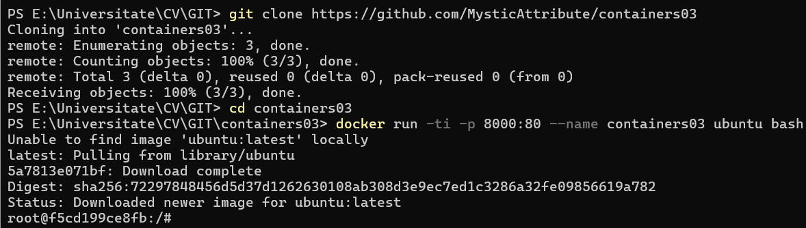
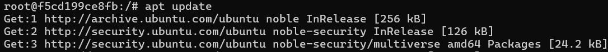
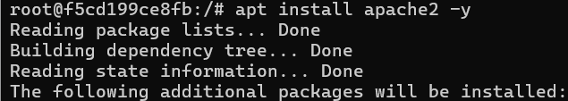
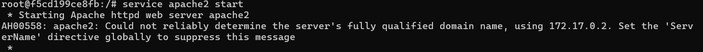
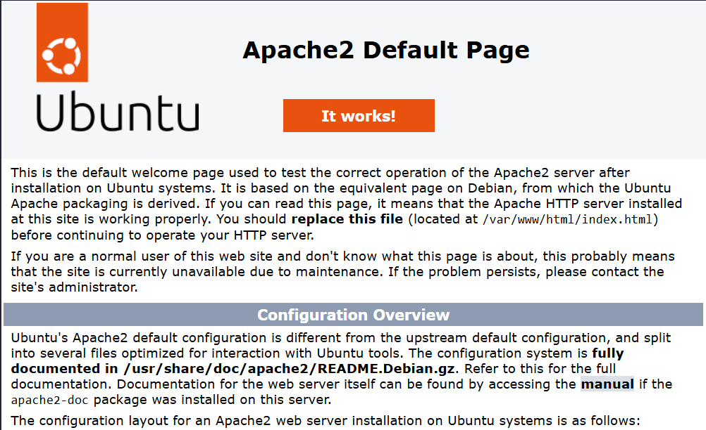
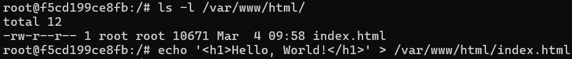
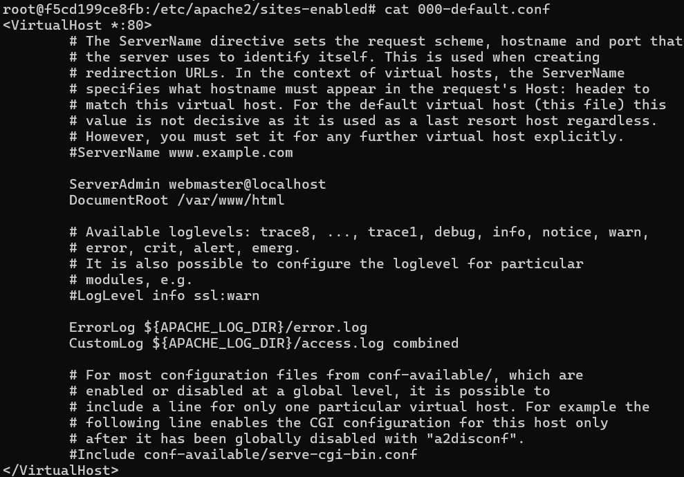
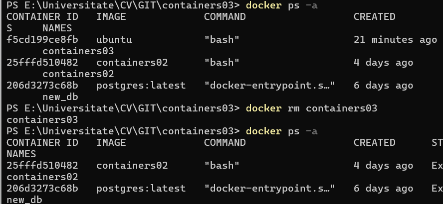

# Prima aplicatie Docker

## Scopul: Familiarizarea cu comenzile de baza ale OS Debian/Ubuntu. Familiarizarea cu Docker si comenzile sale de baza

### Sarcina propusa: Pornind de la imaginea oficiala a sistemului de operare Ubuntu, sa se creeze un container care sa contina un server web Apache, apoi sa se creeze o pagina web care sa contina textul "Hello, World!" si sa se afiseze intr-un browser

### Mod de lucru

1. Crearea si clonarea repozitorului *containers03* pe dispozitivul nostru
2. In directorul proiectului deschidem terminalul si executam urmatoarea comanda:

```shell
docker run -ti -p 8000:80 --name containers03 ubuntu bash
```

Aceasta comanda porneste un container Ubuntu cu un terminal interactiv, expune portul 80 al containerului la portul 8000 al gazdei si il denumeste containers03

Spre deosebire de lucrarea precedenta, aici imaginea nu e una personalizata, ci se foloseste o imagine oficiala a Ubuntu creand imediat un container vizibil in Docker Desktop



3.In termnalul deschis vom rula urmatoarele comenzi:

```shell
apt update
apt install apache2 -y
service apache2 start
```

Explicatie:

- *apt update* - Actualizeaza lista de pachete disponibile din depozitele oficiale( nu va instala nimic )

- *apt install apache2 -y* - Instaleaza serverul web Apache2, iar -y confirma instalarea automat, adica fara sa ceara aprobarea userului

- *service apache2 start* - Va porni serverul-web Apache2. Serverul Apache va incepe sa raspunda la cereri HTTP pe portul implicit 80







Acest mesaj inseamna ca Apache2 nu poate determina numele complet al serverului si foloseste implicit adresa IP a containerului (172.17.0.2)

4.Deschidem browserul si introducem in bara de adrese [http://localhost:8000](http://localhost:8000)



5.Executam urmaoarele comenzi:

```shell
ls -l /var/www/html/
echo '<h1>Hello, World!</h1>' > /var/www/html/index.html
```

- Fisierul index.html are 10 KB, este detinut de root, poate fi citit de toti utilizatorii, dar doar root il poate modifica

- Prin echo noi am suprascris fisierul index.html stergand continutul lui( deoarece am folosit *>* ) si am adaugat in acel fisier un tag HTML cu text



6.Facem refresh la pagina si observam rezultatul


7.Executam urmatoarele comenzi apoi:

```shell
cd /etc/apache2/sites-enabled/
cat 000-default.conf
```

- *cd /etc/apache2/sites-enabled/* - schimbam directorul de lucru pe calea indicata de noi

- *cat 000-default.conf* afiseaza continutul fisierului 000-default.conf in terminal



- Acest fisier defineste configurarea de baza a Apache pentru HTTP pe portul 80. Pagina web este servita din /var/www/html/

8.Afisam lista de containere utilizand comanda aceasta:

```shell
docker ps -a
```

9.Facem delete la containerul *containers03* prin urmatoarea comanda:

```shell
docker rm containers03
```



## Concluzie

Aceasta lucrare de laborator a oferit o introducere practica in utilizarea comenzilor de baza ale sistemului de operare Debian/Ubuntu, precum si in gestionarea containerelor Docker. Am invatat cum sa rulam un container bazat pe imaginea oficiala Ubuntu, sa instalam si configuram un server web Apache in interiorul acestuia si sa afisam o pagina web simpla cu mesajul "Hello, World!". La urma am verificat fisierul Virtual Host cu configurarea de baza a Apache 2, iar apoi am afisat lista containerelor si am sters cel cu care am lucrat, aratand astfel ca nu e neaparat sa utilizam Docker Desktop pentru a crea, rula si sterge containerele, acest lucru poate usor fi facut si in linia de comanda utilizand comenzile corecte

### Bibliografie

- [Docker Official Website](https://www.docker.com/)

- [Apache Official Website](https://httpd.apache.org/)
